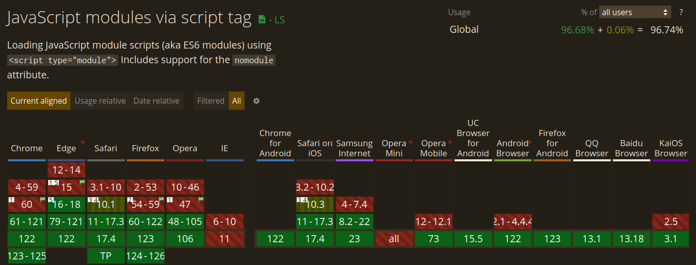

# jsbgl-react-native

## Getting started

```sh
npm i @naftalimurgor/jsbgl-react-native
```
### React
```js
import jsbgl from '@naftalimurgor/jsbgl-react-native/dist/jsbgl.mjs'

function App() {
  useEffect(() => {
    initJsbglModule()

    async function initJsbglModule() {
      await jsbgl.asyncInit()
      console.log(window); // injects jsbgl module to the `window` object
    }

  }, [])

  return (
    <div className="App">
    <p>Hello world!</p>
    </div>
  );
}

export default App;
```
Example snippets on using jsbgl for ESM and React and React Native(ongoing port) bindings for jsbgl.
The ongoing port is available 

## Motivation

ESM(EcmaScript Modules) has become a defacto Module system for Browswer and React Native supports too out of the box. `<script>`, UMD, AMD and other common module systems have been in use but over the years ES6 has become fully supported across many browers

### ESM support across multiple browsers

A brief overview of ESM support from [ESM | Can I use](https://caniuse.com/?search=ESM)

